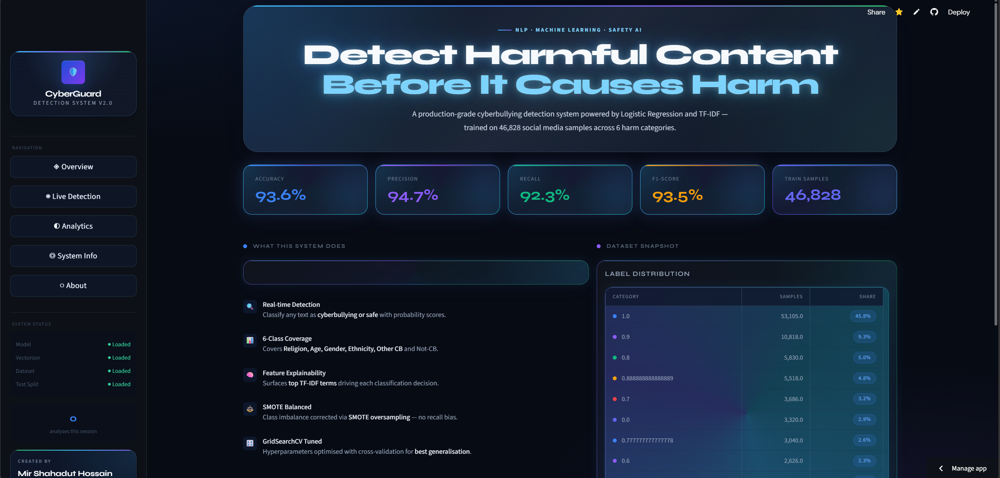
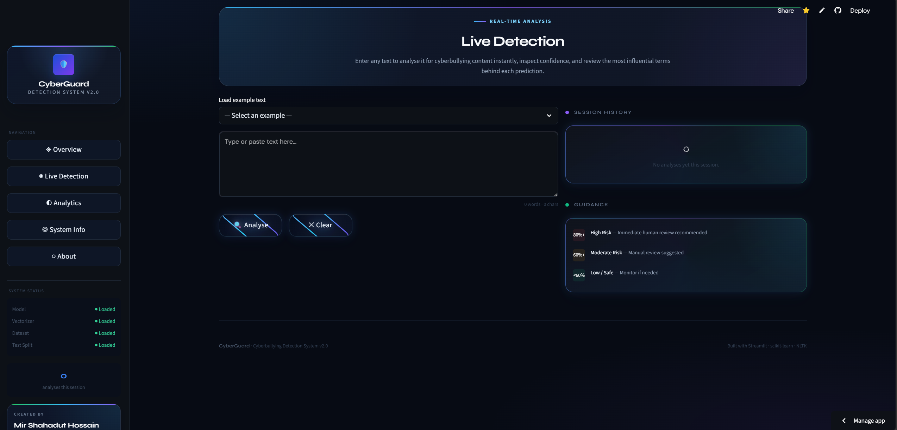
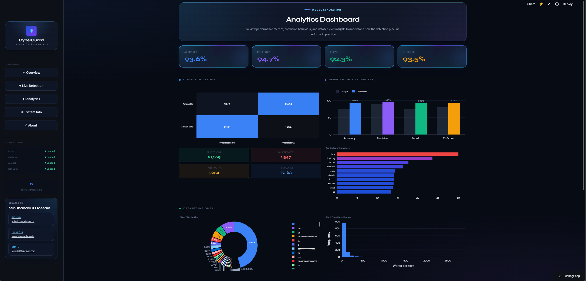
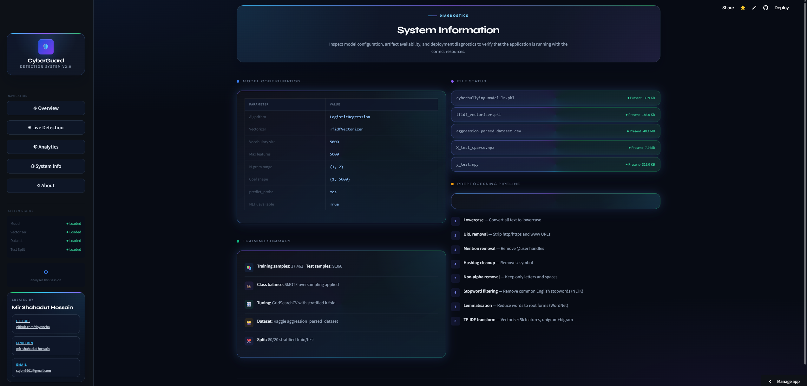

# Cyberbullying Detection System

### Intelligent NLP pipeline for detecting harmful online text with machine learning and a production-style Streamlit dashboard.

---

## Overview

The Cyberbullying Detection System is an NLP-based machine learning project built to identify and classify cyberbullying-related text from social media-style content.

It combines text preprocessing, TF-IDF feature engineering, Logistic Regression classification, and an interactive Streamlit interface to deliver real-time predictions, model insights, and evaluation analytics.

This project is directly relevant to:

- online safety and moderation
- social media monitoring
- harmful content detection workflows
- AI-assisted trust and safety systems

---

## Problem Statement

Cyberbullying is a serious digital safety issue that affects mental health, user well-being, and platform trust.

Manual moderation alone is difficult to scale because:

- online content is generated at high volume
- harmful language can appear in many forms
- abusive text often needs fast intervention
- moderation teams need consistent support tools

Early detection of toxic and harmful language can help platforms build safer online environments and support more responsible content moderation.

---

## Objectives

- Build an end-to-end NLP pipeline for cyberbullying text detection
- Clean and transform raw text into machine-readable features
- Train a reliable classification model for harmful content prediction
- Evaluate performance using standard classification metrics
- Deploy the model in a Streamlit dashboard with a professional user experience
- Provide analytics, interpretability, and system diagnostics for demonstration and review

---

## Key Features

- Real-time text detection for instant cyberbullying classification
- NLP preprocessing pipeline for cleaning and normalizing text
- TF-IDF vectorization for converting text into model-ready numerical features
- Logistic Regression-based machine learning classification
- Premium multi-page Streamlit dashboard
- Analytics and visual insights for model performance and dataset behavior
- Model evaluation with accuracy, precision, recall, F1-score, and confusion matrix
- Explainability features showing influential terms behind predictions

---

## Tech Stack

### Programming

- Python

### Libraries

- pandas
- numpy
- scikit-learn
- matplotlib
- seaborn
- plotly
- joblib
- nltk

### NLP

- TF-IDF Vectorization
- Text preprocessing
- Lemmatization / stopword handling

### Deployment

- Streamlit

### Model

- Logistic Regression

---

## Project Structure

```text
project/
│── app.py
│── README.md
│── requirements.txt
│── runtime.txt
│
│── data/
│   │── aggression_parsed_dataset.csv
│   │── original_dataset_backup.csv
│
│── model/
│   │── cyberbullying_model_lr.pkl
│   │── tfidf_vectorizer.pkl
│   │── X_test_sparse.npz
│   │── y_test.npy
│
│── notebooks/
│   │── cyberbullying_detection_system.ipynb
│
│── scripts/
│   │── save_test_split.py
```

Note: In the current repository, several of these assets are stored at the project root for easier deployment with Streamlit.

---

## Methodology

### 1. Data Collection

- Used a labeled aggression / cyberbullying text dataset
- Prepared structured text-label data for supervised learning

### 2. Data Cleaning

- Removed URLs, mentions, punctuation, and noise
- Standardized text formatting for downstream processing

### 3. Text Preprocessing

- Converted text to lowercase
- Removed stopwords
- Applied token normalization and optional lemmatization

### 4. Feature Engineering (TF-IDF)

- Transformed cleaned text into TF-IDF vectors
- Represented textual patterns as weighted numerical features

### 5. Model Training

- Trained a Logistic Regression classifier
- Used a classical ML pipeline suitable for interpretable text classification

### 6. Evaluation

- Measured classification performance using:
  - Accuracy
  - Precision
  - Recall
  - F1 Score
  - Confusion Matrix

### 7. Deployment

- Built a Streamlit app for:
  - real-time prediction
  - analytics dashboard
  - model diagnostics
  - project presentation

---

## Model Performance

### Core Metrics

- Accuracy: 93.6%
- Precision: 94.7%
- Recall: 92.3%
- F1 Score: 93.5%

### Interpretation

- The model demonstrates strong overall performance for cyberbullying detection.
- High precision suggests the system is effective at reducing false positives.
- Strong recall indicates it can capture most harmful instances successfully.
- The balanced F1 score shows a robust trade-off between sensitivity and prediction quality.

---

## Streamlit App Preview

The Streamlit application provides a polished multi-page dashboard for live prediction, analytics, system inspection, and project presentation.

<p align="center">
  
  
</p>

<p align="center">
  
  
</p>


Suggested screenshots to include:

- Overview page
- Live Detection page
- Analytics dashboard
- System Information page

---

## Key Insights

- TF-IDF with Logistic Regression provides strong baseline performance for harmful text detection.
- Precision-focused performance is especially valuable in moderation support systems.
- Clean preprocessing has a major impact on text classification quality.
- A lightweight classical ML model can still deliver strong results when paired with thoughtful preprocessing and evaluation.
- Dashboard-based deployment significantly improves accessibility for non-technical users.

---

## Future Improvements

- Upgrade to BERT or Transformer-based architectures
- Improve dataset quality and class balance
- Add multi-class cyberbullying category prediction
- Introduce API integration for real-time moderation systems
- Expand explainability with SHAP or LIME
- Strengthen UI/UX for production-style deployment
- Add monitoring and drift analysis for model maintenance

---

## Installation & Usage

### 1. Clone the repository

```bash
git clone https://github.com/doyancha/Cyberbullying_Detection_System.git
cd Cyberbullying_Detection_System
```

### 2. Install dependencies

```bash
pip install -r requirements.txt
```

### 3. Run the Streamlit application

```bash
streamlit run app.py
```

### 4. Open the app

Visit the local Streamlit URL shown in the terminal, typically:

```bash
http://localhost:8501
```

---

## Author

**Mir Shahadut Hossain (doyancha)**  
Data Analyst | Machine Learning Enthusiast | NLP Project Builder

---

## Portfolio Value

This project demonstrates:

- end-to-end NLP workflow design
- machine learning model development and evaluation
- practical deployment with Streamlit
- clean project presentation for a professional portfolio

It is designed to reflect a job-ready approach to data, machine learning, and product-facing analytics work.
